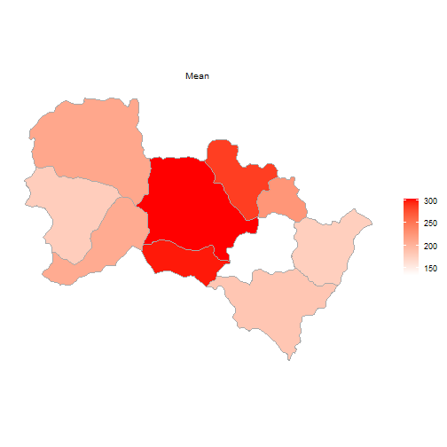
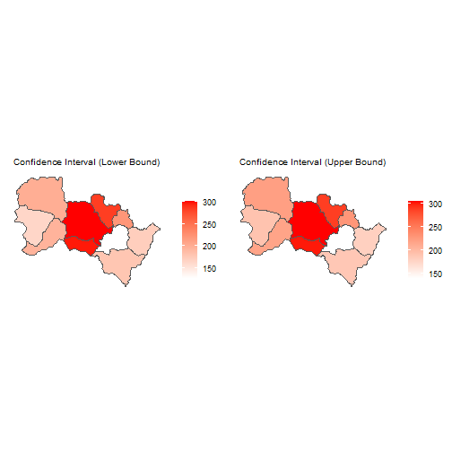

```r
####################################################################
###################    4.1 Getting started    ######################
####################################################################

options(warn=-1)
```

```r
if(FALSE){
  install.packages("devtools")
  install.packages("sf")
  install.packages("tools")
  install.packages("ggpubr")
  install.packages("dplyr")
}

devtools::install_github(repo="linyuehzzz/sandwich_spatial_interpolator",
                         subdir="r/sandwichr", build_vignettes=FALSE)
```

```
## Downloading GitHub repo linyuehzzz/sandwich_spatial_interpolator@HEAD
```

```
##   
  
  
   checking for file 'C:\Users\10716\AppData\Local\Temp\RtmpKOPLen\remotes1970768cbbc\linyuehzzz-sandwich_spatial_interpolator-7d3743d\r\sandwichr/DESCRIPTION' ...
  
v  checking for file 'C:\Users\10716\AppData\Local\Temp\RtmpKOPLen\remotes1970768cbbc\linyuehzzz-sandwich_spatial_interpolator-7d3743d\r\sandwichr/DESCRIPTION' (376ms)
## 
  
  
  
-  preparing 'sandwichr': (530ms)
##    checking DESCRIPTION meta-information ...
  
   checking DESCRIPTION meta-information ... 
  
v  checking DESCRIPTION meta-information
## 
  
  
  
-  checking for LF line-endings in source and make files and shell scripts
## 
  
  
  
-  checking for empty or unneeded directories
## 
  
  
  
-  looking to see if a 'data/datalist' file should be added
## 
  
  
  
-  building 'sandwichr_1.0.0.tar.gz'
## 
  
   
## 
```

```r
library(sandwichr)
library(sf)
library(tools)
library(ggpubr)
library(dplyr)


## Initializing the generator for pseudo random numbers
set.seed(0)


####################################################################
#####################    4.2 Case study 1    #######################
####################################################################
```

```r
hs.sampling.name <- system.file("extdata", "hs.sampling.shapefile.shp",
                                package="sandwichr")
hs.ssh.name <- system.file("extdata", "hs.ssh.shapefile.shp",
                           package="sandwichr")
hs.reporting.name <- system.file("extdata", "hs.reporting.shapefile.shp",
                                 package="sandwichr")
hs.sampling.name
```

```
## [1] "C:/Users/10716/Documents/R/win-library/4.1/sandwichr/extdata/hs.sampling.shapefile.shp"
```

```r
hs.ssh.name
```

```
## [1] "C:/Users/10716/Documents/R/win-library/4.1/sandwichr/extdata/hs.ssh.shapefile.shp"
```

```r
hs.reporting.name
```

```
## [1] "C:/Users/10716/Documents/R/win-library/4.1/sandwichr/extdata/hs.reporting.shapefile.shp"
```

```r
hs.data <- load.data.shp(sampling.file=hs.sampling.name,
                         ssh.file=hs.ssh.name,
                         reporting.file=hs.reporting.name)
# Sampling
head(hs.data[[1]])
```

```
## Simple feature collection with 6 features and 4 fields
## Geometry type: POINT
## Dimension:     XYZ
## Bounding box:  xmin: 156491.4 ymin: 4126601 xmax: 171510.5 ymax: 4153214
## z_range:       zmin: 1320.701 zmax: 1500
## Projected CRS: WGS 84 / UTM zone 50N
## # A tibble: 6 x 5
##   CODE  Population     x     y                      geometry
##   <chr>      <dbl> <dbl> <dbl>                   <POINT [m]>
## 1 02033         31  113.  37.5     Z (156491.4 4153214 1500)
## 2 01007         23  113.  37.2 Z (165240.2 4126601 1320.701)
## 3 01008         38  113.  37.2   Z (166538 4127516 1354.123)
## 4 01009         89  113.  37.3 Z (169540.8 4129381 1370.255)
## 5 01010         22  113.  37.3     Z (170685.2 4130558 1400)
## 6 01011        129  113.  37.3     Z (171510.5 4131899 1400)
```

```r
# SSH
head(hs.data[[2]])
```

```
## Simple feature collection with 5 features and 3 fields
## Geometry type: POLYGON
## Dimension:     XY
## Bounding box:  xmin: 151114.4 ymin: 4106864 xmax: 228423.6 ymax: 4165211
## Projected CRS: WGS 84 / UTM zone 50N
## # A tibble: 5 x 4
##     STR  Area STR_1                                                     geometry
##   <int> <dbl> <chr>                                                <POLYGON [m]>
## 1     1  681. 01    ((174393.7 4131444, 174755.7 4136086, 166016.2 4129531, 161~
## 2     2  445. 02    ((211986.7 4145078, 191141.7 4123426, 191052.7 4123478, 190~
## 3     3  288. 03    ((198113.2 4115589, 201902.7 4118894, 204447.9 4121855, 211~
## 4     4  346. 04    ((222674.5 4139326, 219575.5 4133270, 215318.4 4129568, 211~
## 5     5  427. 05    ((172634.5 4164622, 171285.3 4160901, 169971.9 4159759, 173~
```

```r
# Reporting
head(hs.data[[3]])
```

```
## Simple feature collection with 6 features and 2 fields
## Geometry type: POLYGON
## Dimension:     XY
## Bounding box:  xmin: 151114.4 ymin: 4123480 xmax: 214095.3 ymax: 4165211
## Projected CRS: WGS 84 / UTM zone 50N
## # A tibble: 6 x 3
##   CODE   Area                                                           geometry
##   <chr> <dbl>                                                      <POLYGON [m]>
## 1 02    427.  ((153690.1 4149820, 153647.4 4149999, 153508.5 4150431, 153309.4 ~
## 2 06    143.  ((191225.5 4151326, 191387.6 4151395, 191542.2 4151533, 191625.6 ~
## 3 03    373.  ((178892 4151731, 179098.2 4151712, 179205.5 4151708, 179415.6 41~
## 4 05    252.  ((172768 4143250, 172542.9 4143207, 172248.9 4143115, 171995.3 41~
## 5 10     73.7 ((207615.6 4147664, 207785.4 4147473, 207928.5 4147388, 208079.1 ~
## 6 01    186.  ((172768 4143250, 173154.8 4143172, 173615.2 4143071, 173995.6 41~
```

```r
# Inputing another candidate SSH layer for demonstration
hs.ssh2.name <- system.file("extdata", "hs.ssh2.shapefile.shp",
                            package="sandwichr")
hs.ssh2 <- read_sf(dsn=dirname(hs.ssh2.name),
                   layer=file_path_sans_ext(basename(hs.ssh2.name)))
head(hs.ssh2)
```

```
## Simple feature collection with 6 features and 5 fields
## Geometry type: POLYGON
## Dimension:     XY
## Bounding box:  xmin: 155065.4 ymin: 4106864 xmax: 223212.3 ymax: 4152157
## Projected CRS: WGS 84 / UTM zone 50N
## # A tibble: 6 x 6
##   OBJECTID STR_2 ORIG_FID Shape_Leng Shape_Area                         geometry
##      <dbl> <chr>    <dbl>      <dbl>      <dbl>                    <POLYGON [m]>
## 1        1 09           0     51194. 143518264. ((206800.2 4110983, 206135 4111~
## 2        2 06           1     71117. 252869327. ((202479.4 4129115, 198276.7 41~
## 3        3 02           2     70982. 279692811. ((171908.5 4145105, 174343 4131~
## 4        4 07           3     77891. 327434437. ((198654.2 4151031, 199256.7 41~
## 5        5 08           4     68967. 210398026. ((217681.4 4118480, 217481.2 41~
## 6        7 05           6     65519. 250341301. ((178865.4 4151737, 178892 4151~
```

```r
# Preparing the SSH layer(s) for evaluation
hs.join <- ssh.data.shp(object=hs.data[[1]], ssh.lyr=hs.data[[2]], ssh.id="STR_1")
hs.join <- ssh.data.shp(object=hs.join, ssh.lyr=hs.ssh2, ssh.id="STR_2")
head(hs.join)
```

```
## Simple feature collection with 6 features and 6 fields
## Geometry type: POINT
## Dimension:     XYZ
## Bounding box:  xmin: 156491.4 ymin: 4126601 xmax: 171510.5 ymax: 4153214
## z_range:       zmin: 1320.701 zmax: 1500
## Projected CRS: WGS 84 / UTM zone 50N
## # A tibble: 6 x 7
##   CODE  Population     x     y                      geometry STR_1 STR_2
##   <chr>      <dbl> <dbl> <dbl>                   <POINT [m]> <chr> <chr>
## 1 02033         31  113.  37.5     Z (156491.4 4153214 1500) 05    11   
## 2 01007         23  113.  37.2 Z (165240.2 4126601 1320.701) 05    02   
## 3 01008         38  113.  37.2   Z (166538 4127516 1354.123) 05    02   
## 4 01009         89  113.  37.3 Z (169540.8 4129381 1370.255) 05    02   
## 5 01010         22  113.  37.3     Z (170685.2 4130558 1400) 05    02   
## 6 01011        129  113.  37.3     Z (171510.5 4131899 1400) 05    02
```

```r
# Calculating the geographical detector q-statistic
ssh.test(object=hs.join, y="Population", x=c("STR_1", "STR_2"), test="factor")
```

```
## [[1]]
##       q-statistic      p-value
## STR_1   0.5841001 3.386389e-10
## 
## [[2]]
##       q-statistic      p-value
## STR_2   0.2540372 8.683782e-06
```

```r
# Calculating the interaction detector
ssh.test(object=hs.join, y="Population", x=c("STR_1", "STR_2"), test="interaction")
```

```
##      [,1]    [,2]    [,3]               
## [1,] "STR_1" "STR_2" "0.620092311481712"
## [2,] "STR_1" "STR_1" "0.58410012034806" 
## [3,] "STR_2" "STR_2" "0.254037208669126"
```

```r
# Perform the SSH based spatial interpolation
hs.sw <- sandwich.model(object=hs.data, sampling.attr="Population", type="shp")
head(hs.sw$object)
```

```
## Simple feature collection with 6 features and 5 fields
## Geometry type: POLYGON
## Dimension:     XY
## Bounding box:  xmin: 151114.4 ymin: 4123480 xmax: 214095.3 ymax: 4165211
## Projected CRS: WGS 84 / UTM zone 50N
## # A tibble: 6 x 6
##   CODE   Area                                         geometry  mean    se    df
##   <chr> <dbl>                                    <POLYGON [m]> <dbl> <dbl> <dbl>
## 1 02    427.  ((153690.1 4149820, 153647.4 4149999, 153508.5 ~  211.  5.28    91
## 2 06    143.  ((191225.5 4151326, 191387.6 4151395, 191542.2 ~  287.  1.28    18
## 3 03    373.  ((178892 4151731, 179098.2 4151712, 179205.5 41~  304.  1.21    90
## 4 05    252.  ((172768 4143250, 172542.9 4143207, 172248.9 41~  178.  6.80    91
## 5 10     73.7 ((207615.6 4147664, 207785.4 4147473, 207928.5 ~  225.  1.94    40
## 6 01    186.  ((172768 4143250, 173154.8 4143172, 173615.2 41~  207.  5.46    91
```

```r
summary(hs.sw)
```

```
##        Length Class Mode
## object 6      sf    list
```

```r
# Calculating the confidence intervals of the interpolation estimates
hs.sw.ci <- sandwich.ci(object=hs.sw, level=.95)
head(hs.sw.ci$object$object)
```

```
## Simple feature collection with 6 features and 7 fields
## Geometry type: POLYGON
## Dimension:     XY
## Bounding box:  xmin: 151114.4 ymin: 4123480 xmax: 214095.3 ymax: 4165211
## Projected CRS: WGS 84 / UTM zone 50N
## # A tibble: 6 x 8
##   CODE   Area                            geometry  mean    se    df ci.low ci.up
##   <chr> <dbl>                       <POLYGON [m]> <dbl> <dbl> <dbl>  <dbl> <dbl>
## 1 02    427.  ((153690.1 4149820, 153647.4 41499~  211.  5.28    91   201.  222.
## 2 06    143.  ((191225.5 4151326, 191387.6 41513~  287.  1.28    18   284.  289.
## 3 03    373.  ((178892 4151731, 179098.2 4151712~  304.  1.21    90   301.  306.
## 4 05    252.  ((172768 4143250, 172542.9 4143207~  178.  6.80    91   165.  192.
## 5 10     73.7 ((207615.6 4147664, 207785.4 41474~  225.  1.94    40   221.  229.
## 6 01    186.  ((172768 4143250, 173154.8 4143172~  207.  5.46    91   196.  218.
```

```r
summary(hs.sw.ci)
```

```
##        Length Class          Mode
## object 1      sandwich.model list
```

```r
# Plotting
ggplot2::autoplot(object=hs.sw)
```



```r
ggplot2::autoplot(object=hs.sw.ci)
```



```r
hs.cv <- sandwich.cv(object=hs.data, sampling.attr="Population", k=5, type="shp")
hs.cv
```

```
## [1] 116.5024
```

```r
####################################################################
#####################    4.3 Case study 2    #######################
####################################################################
```

```r
bc.sampling_ssh.name <- system.file("extdata", "bc_sampling_ssh.csv",
                                    package="sandwichr")
bc.reporting_ssh.name <- system.file("extdata", "bc_reporting_ssh.csv",
                                     package="sandwichr")
bc.sampling_ssh.name
```

```
## [1] "C:/Users/10716/Documents/R/win-library/4.1/sandwichr/extdata/bc_sampling_ssh.csv"
```

```r
bc.reporting_ssh.name
```

```
## [1] "C:/Users/10716/Documents/R/win-library/4.1/sandwichr/extdata/bc_reporting_ssh.csv"
```

```r
bc.data <- load.data.txt(sampling_ssh.file=bc.sampling_ssh.name,
                         reporting_ssh.file=bc.reporting_ssh.name)

head(bc.data[[1]])    # Sampling-SSH
```

```
##   GBCODE Incidence SSHID        X        Y
## 1 110100        42     1 115.9642 39.86494
## 2 120100        44     1 117.3913 39.01184
## 3 120225        26     2 117.4309 40.00251
## 4 130129         9     2 114.2797 37.61767
## 5 130181        36     1 115.2870 37.91756
## 6 130227        20     2 118.3576 40.23177
```

```r
head(bc.data[[2]])    # Reporting-SSH
```

```
##   GBCODE        W1        W2
## 1 110100 0.8736000 0.1264000
## 2 110112 0.6115000 0.3885000
## 3 110113 0.5378000 0.4622000
## 4 110221 0.5245597 0.4754403
## 5 110224 0.5245597 0.4754403
## 6 110226 0.5245597 0.4754403
```

```r
bc.join <- ssh.data.txt(object=bc.data)
head(bc.join)
```

```
##   GBCODE Incidence SSHID        X        Y
## 1 110100        42     1 115.9642 39.86494
## 2 120100        44     1 117.3913 39.01184
## 3 120225        26     2 117.4309 40.00251
## 4 130129         9     2 114.2797 37.61767
## 5 130181        36     1 115.2870 37.91756
## 6 130227        20     2 118.3576 40.23177
```

```r
# Calculating the geographical detector q-statistic
ssh.test(object=bc.join, y="Incidence", x="SSHID", test="factor", type="txt")
```

```
## [[1]]
##       q-statistic      p-value
## SSHID   0.5165114 7.219864e-11
```

```r
# Visualizing urban-rural disparities
p <- ggerrorplot(bc.data[[1]], x="SSHID", y="Incidence",
                desc_stat="mean_sd", color="black",
                add="violin", add.params=list(color = "darkgray")
)

p + scale_x_discrete(labels=c("1"="Urban", "2"="Rural")) +
  theme(axis.title.x=element_blank()) + labs(y="Breast Cancer Incidence\n(Rate per 100,000)")
```

-1.png)

```r
bc.data[[1]] %>%
  group_by(SSHID) %>%
  summarise_at(vars(Incidence),
               list(name = mean))
```

```
## # A tibble: 2 x 2
##   SSHID  name
##   <int> <dbl>
## 1     1  31.6
## 2     2  17.5
```

```r
# Performing the SSH based spatial interpolation
bc.sw <- sandwich.model(object=bc.data, sampling.attr="Incidence", type="txt",
                        ssh.id.col="SSHID", ssh.weights=list(c(1,2), c("W1","W2")))
head(bc.sw$object)
```

```
##   GBCODE        W1        W2     mean        se  df
## 1 110100 0.8736000 0.1264000 29.78768 0.7965111 240
## 2 110112 0.6115000 0.3885000 26.11263 0.6894776 240
## 3 110113 0.5378000 0.4622000 25.07924 0.6604525 240
## 4 110221 0.5245597 0.4754403 24.89360 0.6552986 240
## 5 110224 0.5245597 0.4754403 24.89360 0.6552986 240
## 6 110226 0.5245597 0.4754403 24.89360 0.6552986 240
```

```r
summary(bc.sw)
```

```
##        Length Class      Mode
## object 6      data.frame list
```

```r
# Calculating the confidence intervals of the interpolation estimates
bc.sw.ci <- sandwich.ci(object=bc.sw, level=.95)
head(bc.sw.ci$object$object)
```

```
##   GBCODE        W1        W2     mean        se  df   ci.low    ci.up
## 1 110100 0.8736000 0.1264000 29.78768 0.7965111 240 28.21863 31.35672
## 2 110112 0.6115000 0.3885000 26.11263 0.6894776 240 24.75443 27.47083
## 3 110113 0.5378000 0.4622000 25.07924 0.6604525 240 23.77822 26.38027
## 4 110221 0.5245597 0.4754403 24.89360 0.6552986 240 23.60272 26.18447
## 5 110224 0.5245597 0.4754403 24.89360 0.6552986 240 23.60272 26.18447
## 6 110226 0.5245597 0.4754403 24.89360 0.6552986 240 23.60272 26.18447
```

```r
summary(bc.sw.ci)
```

```
##        Length Class          Mode
## object 1      sandwich.model list
```

```r
bc.cv <- sandwich.cv(object=bc.data, sampling.attr="Incidence", k=5, type="txt",
                     ssh.id.col="SSHID", reporting.id.col="GBCODE",
                     ssh.weights=list(c(1,2), c("W1","W2")))
bc.cv
```

```
## [1] 8.687603
```

```r
knitr::spin("code.R")
```

```
## 
## 
## processing file: code.Rmd
```

```
## Error in parse_block(g[-1], g[1], params.src, markdown_mode): Duplicate chunk label '4.1.1 Installing packages', which has been used for the chunk:
## if(FALSE){
##   install.packages("devtools")
##   install.packages("sf")
##   install.packages("tools")
##   install.packages("ggpubr")
##   install.packages("dplyr")
## }
## 
## devtools::install_github(repo="linyuehzzz/sandwich_spatial_interpolator",
##                          subdir="r/sandwichr", build_vignettes=FALSE)
```

