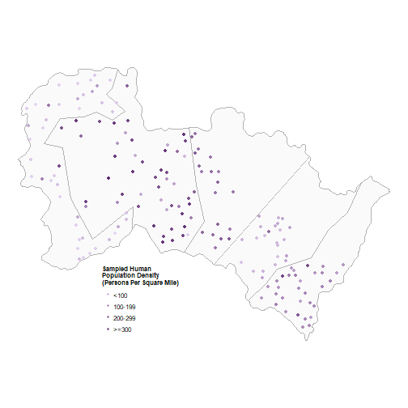
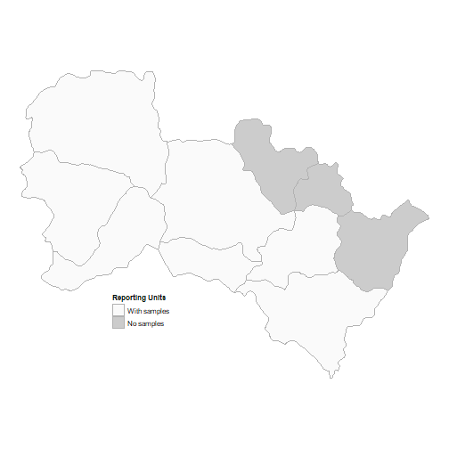
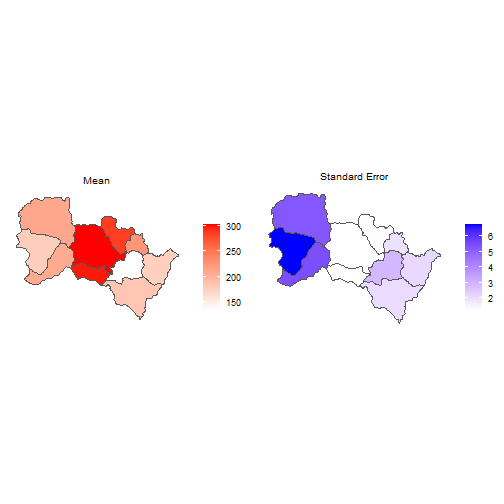
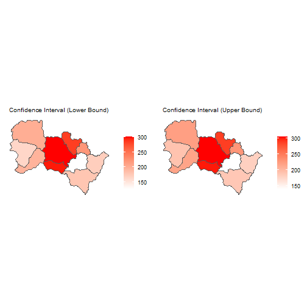
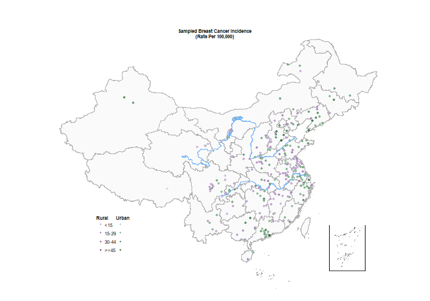
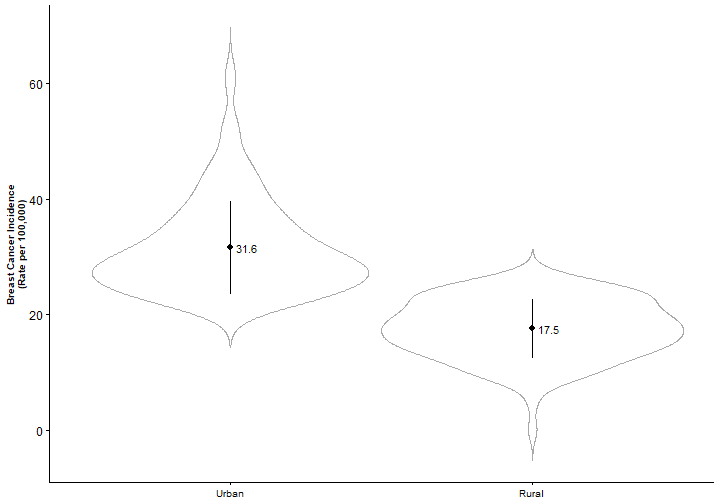

```r
####################################################################
###################    4.1 Getting started    ######################
####################################################################

options(warn=-1)
```

```r
if(FALSE){
  install.packages("sandwichr")
  install.packages("sf")
  install.packages("tools")
  install.packages("ggpubr")
  install.packages("dplyr")
  install.packages("ggplot2")
  install.packages("ggnewscale")
  install.packages("png")
  install.packages("grid")
}
```

```r
library(sandwichr)
library(ggnewscale)
library(ggplot2)
library(sf)
library(tools)
library(ggpubr)
library(dplyr)
library(png)
library(grid)


## Initializing the generator for pseudo random numbers
set.seed(0)


####################################################################
#####################    4.2 Case study 1    #######################
####################################################################
```

```r
hs.sampling.name <- system.file("extdata", "hs.sampling.shapefile.shp",
                                package="sandwichr")
hs.ssh.name <- system.file("extdata", "hs.ssh.shapefile.shp",
                           package="sandwichr")
hs.reporting.name <- system.file("extdata", "hs.reporting.shapefile.shp",
                                 package="sandwichr")
hs.sampling.name
```

```
## [1] "C:/Users/10716/Documents/R/win-library/4.1/sandwichr/extdata/hs.sampling.shapefile.shp"
```

```r
hs.ssh.name
```

```
## [1] "C:/Users/10716/Documents/R/win-library/4.1/sandwichr/extdata/hs.ssh.shapefile.shp"
```

```r
hs.reporting.name
```

```
## [1] "C:/Users/10716/Documents/R/win-library/4.1/sandwichr/extdata/hs.reporting.shapefile.shp"
```

```r
hs.data <- load.data.shp(sampling.file=hs.sampling.name,
                         ssh.file=hs.ssh.name,
                         reporting.file=hs.reporting.name)
# Sampling
head(hs.data[[1]])
```

```
## Simple feature collection with 6 features and 4 fields
## Geometry type: POINT
## Dimension:     XYZ
## Bounding box:  xmin: 156491.4 ymin: 4126601 xmax: 171510.5 ymax: 4153214
## z_range:       zmin: 1320.701 zmax: 1500
## Projected CRS: WGS 84 / UTM zone 50N
## # A tibble: 6 x 5
##   CODE  Population     x     y                      geometry
##   <chr>      <dbl> <dbl> <dbl>                   <POINT [m]>
## 1 02033         31  113.  37.5     Z (156491.4 4153214 1500)
## 2 01007         23  113.  37.2 Z (165240.2 4126601 1320.701)
## 3 01008         38  113.  37.2   Z (166538 4127516 1354.123)
## 4 01009         89  113.  37.3 Z (169540.8 4129381 1370.255)
## 5 01010         22  113.  37.3     Z (170685.2 4130558 1400)
## 6 01011        129  113.  37.3     Z (171510.5 4131899 1400)
```

```r
class(hs.data[[1]])
```

```
## [1] "sf"         "tbl_df"     "tbl"        "data.frame"
```

```r
attributes(hs.data[[1]])
```

```
## $names
## [1] "CODE"       "Population" "x"          "y"          "geometry"  
## 
## $row.names
##   [1]   1   2   3   4   5   6   7   8   9  10  11  12  13  14  15  16  17  18  19  20  21
##  [22]  22  23  24  25  26  27  28  29  30  31  32  33  34  35  36  37  38  39  40  41  42
##  [43]  43  44  45  46  47  48  49  50  51  52  53  54  55  56  57  58  59  60  61  62  63
##  [64]  64  65  66  67  68  69  70  71  72  73  74  75  76  77  78  79  80  81  82  83  84
##  [85]  85  86  87  88  89  90  91  92  93  94  95  96  97  98  99 100 101 102 103 104 105
## [106] 106 107 108 109 110 111 112 113 114 115 116 117 118 119 120 121 122 123 124 125 126
## [127] 127 128 129 130 131 132 133 134 135 136 137 138 139 140 141 142 143 144 145 146 147
## [148] 148 149 150 151 152 153 154 155 156 157 158 159 160 161 162 163 164 165 166 167
## 
## $class
## [1] "sf"         "tbl_df"     "tbl"        "data.frame"
## 
## $sf_column
## [1] "geometry"
## 
## $agr
##       CODE Population          x          y 
##       <NA>       <NA>       <NA>       <NA> 
## Levels: constant aggregate identity
```

```r
summary(hs.data[[1]])
```

```
##      CODE             Population          x               y                  geometry  
##  Length:167         Min.   : 21.0   Min.   :113.1   Min.   :37.09   POINT Z      :167  
##  Class :character   1st Qu.: 92.0   1st Qu.:113.3   1st Qu.:37.22   epsg:32650   :  0  
##  Mode  :character   Median :184.0   Median :113.4   Median :37.30   +proj=utm ...:  0  
##                     Mean   :208.1   Mean   :113.4   Mean   :37.32                      
##                     3rd Qu.:309.5   3rd Qu.:113.7   3rd Qu.:37.41                      
##                     Max.   :474.0   Max.   :113.8   Max.   :37.56
```

```r
# SSH
head(hs.data[[2]])
```

```
## Simple feature collection with 5 features and 3 fields
## Geometry type: POLYGON
## Dimension:     XY
## Bounding box:  xmin: 151114.4 ymin: 4106864 xmax: 228423.6 ymax: 4165211
## Projected CRS: WGS 84 / UTM zone 50N
## # A tibble: 5 x 4
##     STR  Area STR_1                                                                geometry
##   <int> <dbl> <chr>                                                           <POLYGON [m]>
## 1     1  681. 01    ((174393.7 4131444, 174755.7 4136086, 166016.2 4129531, 161699.4 41381~
## 2     2  445. 02    ((211986.7 4145078, 191141.7 4123426, 191052.7 4123478, 190869.3 41236~
## 3     3  288. 03    ((198113.2 4115589, 201902.7 4118894, 204447.9 4121855, 211523.4 41239~
## 4     4  346. 04    ((222674.5 4139326, 219575.5 4133270, 215318.4 4129568, 211523.4 41239~
## 5     5  427. 05    ((172634.5 4164622, 171285.3 4160901, 169971.9 4159759, 173841 4156024~
```

```r
class(hs.data[[2]])
```

```
## [1] "sf"         "tbl_df"     "tbl"        "data.frame"
```

```r
attributes(hs.data[[2]])
```

```
## $names
## [1] "STR"      "Area"     "STR_1"    "geometry"
## 
## $row.names
## [1] 1 2 3 4 5
## 
## $class
## [1] "sf"         "tbl_df"     "tbl"        "data.frame"
## 
## $sf_column
## [1] "geometry"
## 
## $agr
##   STR  Area STR_1 
##  <NA>  <NA>  <NA> 
## Levels: constant aggregate identity
```

```r
summary(hs.data[[2]])
```

```
##       STR         Area          STR_1                    geometry
##  Min.   :1   Min.   :288.1   Length:5           POLYGON      :5  
##  1st Qu.:2   1st Qu.:346.4   Class :character   epsg:32650   :0  
##  Median :3   Median :427.5   Mode  :character   +proj=utm ...:0  
##  Mean   :3   Mean   :437.6                                       
##  3rd Qu.:4   3rd Qu.:444.8                                       
##  Max.   :5   Max.   :681.3
```

```r
# Reporting
head(hs.data[[3]])
```

```
## Simple feature collection with 6 features and 2 fields
## Geometry type: POLYGON
## Dimension:     XY
## Bounding box:  xmin: 151114.4 ymin: 4123480 xmax: 214095.3 ymax: 4165211
## Projected CRS: WGS 84 / UTM zone 50N
## # A tibble: 6 x 3
##   CODE   Area                                                                      geometry
##   <chr> <dbl>                                                                 <POLYGON [m]>
## 1 02    427.  ((153690.1 4149820, 153647.4 4149999, 153508.5 4150431, 153309.4 4150834, 15~
## 2 06    143.  ((191225.5 4151326, 191387.6 4151395, 191542.2 4151533, 191625.6 4151652, 19~
## 3 03    373.  ((178892 4151731, 179098.2 4151712, 179205.5 4151708, 179415.6 4151773, 1797~
## 4 05    252.  ((172768 4143250, 172542.9 4143207, 172248.9 4143115, 171995.3 4143000, 1718~
## 5 10     73.7 ((207615.6 4147664, 207785.4 4147473, 207928.5 4147388, 208079.1 4147346, 20~
## 6 01    186.  ((172768 4143250, 173154.8 4143172, 173615.2 4143071, 173995.6 4143036, 1741~
```

```r
class(hs.data[[3]])
```

```
## [1] "sf"         "tbl_df"     "tbl"        "data.frame"
```

```r
attributes(hs.data[[3]])
```

```
## $names
## [1] "CODE"     "Area"     "geometry"
## 
## $row.names
##  [1]  1  2  3  4  5  6  7  8  9 10
## 
## $class
## [1] "sf"         "tbl_df"     "tbl"        "data.frame"
## 
## $sf_column
## [1] "geometry"
## 
## $agr
## CODE Area 
## <NA> <NA> 
## Levels: constant aggregate identity
```

```r
summary(hs.data[[3]])
```

```
##      CODE                Area                 geometry 
##  Length:10          Min.   : 73.71   POLYGON      :10  
##  Class :character   1st Qu.:148.73   epsg:32650   : 0  
##  Mode  :character   Median :183.90   +proj=utm ...: 0  
##                     Mean   :218.81                     
##                     3rd Qu.:268.99                     
##                     Max.   :427.12
```

```r
# Visualizing data inputs (Figure 5a)
ggplot() +
  geom_sf(data=hs.data[[2]],
          aes(fill=STR),
          fill="#FAFAFA", 
          colour="#B2B2B2") + 
  geom_sf(data=hs.data[[1]], 
          aes(colour=Population)) +
  scale_color_gradient(low="#E5D5F2",
                       high="#5D2C70",
                       breaks=c(100,200,300,400),
                       labels=c("<100","100-199","200-299",">=300"),
                       guide=guide_legend(title="Sampled Human\nPopulation Density\n(Persons Per Square Mile)",
                                          override.aes=list(shape=c(20,20)))) +
  coord_sf(crs=st_crs(4283)) +
  theme_void() +
  theme(
    legend.key.size=unit(0.5,'cm'),
    legend.justification=c(0,1),
    legend.position=c(0.25,0.3),
    legend.spacing.x=unit(0,'cm'),
    legend.title=element_text(face="bold", size=8),
    legend.text=element_text(size=8)
  )
```



```r
ggsave("outputs/Fig5-1.eps", 
       width=11, 
       height=9, 
       units="cm")

# Visualizing data inputs (Figure 5b)
hs.plot.5b <- hs.data[[3]]
hs.plot.5b$group = c(0,1,0,0,1,0,1,0,0,0)
ggplot() +
  geom_sf(data=hs.plot.5b,
          aes(fill=as.factor(group)),
          colour="#B2B2B2") + 
  scale_fill_manual(values = c("#FAFAFA","gray80"),
                    labels=c("With samples","No samples"),
                    guide=guide_legend(title="Reporting Units")) +
  theme_void() +
  theme(
    legend.key.size=unit(0.5,'cm'),
    legend.justification=c(0,1),
    legend.position=c(0.25,0.3),
    legend.spacing.x=unit(0.1,'cm'),
    legend.title=element_text(face="bold", size=8),
    legend.text=element_text(size=8)
  )
```



```r
ggsave("outputs/Fig5-2.eps", 
       width=11, 
       height=9, 
       units="cm")
```

```r
# Inputing another candidate SSH layer for demonstration
hs.ssh2.name <- system.file("extdata", "hs.ssh2.shapefile.shp",
                            package="sandwichr")
hs.ssh2 <- read_sf(dsn=dirname(hs.ssh2.name),
                   layer=file_path_sans_ext(basename(hs.ssh2.name)))
head(hs.ssh2)
```

```
## Simple feature collection with 6 features and 5 fields
## Geometry type: POLYGON
## Dimension:     XY
## Bounding box:  xmin: 155065.4 ymin: 4106864 xmax: 223212.3 ymax: 4152157
## Projected CRS: WGS 84 / UTM zone 50N
## # A tibble: 6 x 6
##   OBJECTID STR_2 ORIG_FID Shape_Leng Shape_Area                                    geometry
##      <dbl> <chr>    <dbl>      <dbl>      <dbl>                               <POLYGON [m]>
## 1        1 09           0     51194. 143518264. ((206800.2 4110983, 206135 4111509, 205122~
## 2        2 06           1     71117. 252869327. ((202479.4 4129115, 198276.7 4122973, 1974~
## 3        3 02           2     70982. 279692811. ((171908.5 4145105, 174343 4131364, 174257~
## 4        4 07           3     77891. 327434437. ((198654.2 4151031, 199256.7 4150224, 1994~
## 5        5 08           4     68967. 210398026. ((217681.4 4118480, 217481.2 4118458, 2172~
## 6        7 05           6     65519. 250341301. ((178865.4 4151737, 178892 4151731, 179098~
```

```r
# Preparing the SSH layer(s) for evaluation
hs.join <- ssh.data.shp(object=hs.data[[1]], 
                        ssh.lyr=hs.data[[2]], 
                        ssh.id="STR_1")
hs.join <- ssh.data.shp(object=hs.join, 
                        ssh.lyr=hs.ssh2, 
                        ssh.id="STR_2")
head(hs.join)
```

```
## Simple feature collection with 6 features and 6 fields
## Geometry type: POINT
## Dimension:     XYZ
## Bounding box:  xmin: 156491.4 ymin: 4126601 xmax: 171510.5 ymax: 4153214
## z_range:       zmin: 1320.701 zmax: 1500
## Projected CRS: WGS 84 / UTM zone 50N
## # A tibble: 6 x 7
##   CODE  Population     x     y                      geometry STR_1 STR_2
##   <chr>      <dbl> <dbl> <dbl>                   <POINT [m]> <chr> <chr>
## 1 02033         31  113.  37.5     Z (156491.4 4153214 1500) 05    11   
## 2 01007         23  113.  37.2 Z (165240.2 4126601 1320.701) 05    02   
## 3 01008         38  113.  37.2   Z (166538 4127516 1354.123) 05    02   
## 4 01009         89  113.  37.3 Z (169540.8 4129381 1370.255) 05    02   
## 5 01010         22  113.  37.3     Z (170685.2 4130558 1400) 05    02   
## 6 01011        129  113.  37.3     Z (171510.5 4131899 1400) 05    02
```

```r
# Calculating the geographical detector q-statistic
ssh.test(object=hs.join, 
         y="Population", 
         x=c("STR_1", "STR_2"), 
         test="factor")
```

```
## [[1]]
##       q-statistic      p-value
## STR_1   0.5841001 3.386389e-10
## 
## [[2]]
##       q-statistic      p-value
## STR_2   0.2540372 8.683782e-06
```

```r
# Calculating the interaction detector
ssh.test(object=hs.join, 
         y="Population", 
         x=c("STR_1", "STR_2"), 
         test="interaction")
```

```
##      [,1]    [,2]    [,3]               
## [1,] "STR_1" "STR_2" "0.620092311481712"
## [2,] "STR_1" "STR_1" "0.58410012034806" 
## [3,] "STR_2" "STR_2" "0.254037208669126"
```

```r
# Perform the SSH based spatial interpolation
hs.sw <- sandwich.model(object=hs.data, 
                        sampling.attr="Population", 
                        type="shp")
head(hs.sw$object)
```

```
## Simple feature collection with 6 features and 5 fields
## Geometry type: POLYGON
## Dimension:     XY
## Bounding box:  xmin: 151114.4 ymin: 4123480 xmax: 214095.3 ymax: 4165211
## Projected CRS: WGS 84 / UTM zone 50N
## # A tibble: 6 x 6
##   CODE   Area                                                    geometry  mean    se    df
##   <chr> <dbl>                                               <POLYGON [m]> <dbl> <dbl> <dbl>
## 1 02    427.  ((153690.1 4149820, 153647.4 4149999, 153508.5 4150431, 15~  211.  5.28    91
## 2 06    143.  ((191225.5 4151326, 191387.6 4151395, 191542.2 4151533, 19~  287.  1.28    18
## 3 03    373.  ((178892 4151731, 179098.2 4151712, 179205.5 4151708, 1794~  304.  1.21    90
## 4 05    252.  ((172768 4143250, 172542.9 4143207, 172248.9 4143115, 1719~  178.  6.80    91
## 5 10     73.7 ((207615.6 4147664, 207785.4 4147473, 207928.5 4147388, 20~  225.  1.94    40
## 6 01    186.  ((172768 4143250, 173154.8 4143172, 173615.2 4143071, 1739~  207.  5.46    91
```

```r
summary(hs.sw)
```

```
## [1] "Sample size:  167"
## [1] "Number of strata:  5"
## [1] "Number of reporting units:  10"
```

```
##       mean             se                 geometry 
##  Min.   :133.7   Min.   :1.214   POLYGON      :10  
##  1st Qu.:179.7   1st Qu.:1.446   epsg:32650   : 0  
##  Median :209.3   Median :2.105   +proj=utm ...: 0  
##  Mean   :220.7   Mean   :3.035                     
##  3rd Qu.:271.4   3rd Qu.:4.697                     
##  Max.   :303.7   Max.   :6.800
```

```r
sf::st_write(obj=hs.sw$object, 
             dsn="outputs/hs.sw.shp")
```

```
## Layer hs.sw in dataset outputs/hs.sw.shp already exists:
## use either append=TRUE to append to layer or append=FALSE to overwrite layer
```

```
## Error in CPL_write_ogr(obj, dsn, layer, driver, as.character(dataset_options), : Dataset already exists.
```

```r
# Calculating the confidence intervals of the interpolation estimates
hs.sw.ci <- sandwich.ci(object=hs.sw, 
                        level=.95)
head(hs.sw.ci$object$object)
```

```
## Simple feature collection with 6 features and 7 fields
## Geometry type: POLYGON
## Dimension:     XY
## Bounding box:  xmin: 151114.4 ymin: 4123480 xmax: 214095.3 ymax: 4165211
## Projected CRS: WGS 84 / UTM zone 50N
## # A tibble: 6 x 8
##   CODE   Area                                       geometry  mean    se    df ci.low ci.up
##   <chr> <dbl>                                  <POLYGON [m]> <dbl> <dbl> <dbl>  <dbl> <dbl>
## 1 02    427.  ((153690.1 4149820, 153647.4 4149999, 153508.~  211.  5.28    91   201.  222.
## 2 06    143.  ((191225.5 4151326, 191387.6 4151395, 191542.~  287.  1.28    18   284.  289.
## 3 03    373.  ((178892 4151731, 179098.2 4151712, 179205.5 ~  304.  1.21    90   301.  306.
## 4 05    252.  ((172768 4143250, 172542.9 4143207, 172248.9 ~  178.  6.80    91   165.  192.
## 5 10     73.7 ((207615.6 4147664, 207785.4 4147473, 207928.~  225.  1.94    40   221.  229.
## 6 01    186.  ((172768 4143250, 173154.8 4143172, 173615.2 ~  207.  5.46    91   196.  218.
```

```r
summary(hs.sw.ci)
```

```
##      ci.low          ci.up                geometry 
##  Min.   :127.8   Min.   :139.7   POLYGON      :10  
##  1st Qu.:174.0   1st Qu.:188.9   epsg:32650   : 0  
##  Median :198.6   Median :220.0   +proj=utm ...: 0  
##  Mean   :214.6   Mean   :226.7                     
##  3rd Qu.:268.4   3rd Qu.:274.4                     
##  Max.   :301.3   Max.   :306.1
```

```r
sf::st_write(obj=hs.sw.ci$object$object, 
             dsn="outputs/hs.sw.ci.shp")
```

```
## Layer hs.sw.ci in dataset outputs/hs.sw.ci.shp already exists:
## use either append=TRUE to append to layer or append=FALSE to overwrite layer
```

```
## Error in CPL_write_ogr(obj, dsn, layer, driver, as.character(dataset_options), : Dataset already exists.
```

```r
# Plotting (Figures 6 and 7)
ggplot2::autoplot(object=hs.sw)
```



```r
ggplot2::autoplot(object=hs.sw.ci)
```



```r
hs.cv <- sandwich.cv(object=hs.data, 
                     sampling.attr="Population", 
                     k=5, 
                     type="shp")
hs.cv
```

```
## [1] 116.5024
```

```r
####################################################################
#####################    4.3 Case study 2    #######################
####################################################################
```

```r
bc.sampling_ssh.name <- system.file("extdata", "bc_sampling_ssh.csv",
                                    package="sandwichr")
bc.reporting_ssh.name <- system.file("extdata", "bc_reporting_ssh.csv",
                                     package="sandwichr")
bc.sampling_ssh.name
```

```
## [1] "C:/Users/10716/Documents/R/win-library/4.1/sandwichr/extdata/bc_sampling_ssh.csv"
```

```r
bc.reporting_ssh.name
```

```
## [1] "C:/Users/10716/Documents/R/win-library/4.1/sandwichr/extdata/bc_reporting_ssh.csv"
```

```r
bc.data <- load.data.txt(sampling_ssh.file=bc.sampling_ssh.name,
                         reporting_ssh.file=bc.reporting_ssh.name)

# Sampling-SSH
head(bc.data[[1]])    
```

```
##   GBCODE Incidence SSHID        X        Y
## 1 110100        42     1 115.9642 39.86494
## 2 120100        44     1 117.3913 39.01184
## 3 120225        26     2 117.4309 40.00251
## 4 130129         9     2 114.2797 37.61767
## 5 130181        36     1 115.2870 37.91756
## 6 130227        20     2 118.3576 40.23177
```

```r
class(bc.data[[1]])
```

```
## [1] "data.frame"
```

```r
summary(bc.data[[1]])
```

```
##      GBCODE         Incidence         SSHID             X                Y        
##  Min.   :110100   Min.   : 0.00   Min.   :1.000   Min.   : 86.04   Min.   :18.57  
##  1st Qu.:320682   1st Qu.:18.00   1st Qu.:1.000   1st Qu.:111.83   1st Qu.:29.27  
##  Median :360924   Median :24.00   Median :1.000   Median :115.25   Median :32.51  
##  Mean   :363302   Mean   :24.78   Mean   :1.483   Mean   :114.52   Mean   :32.84  
##  3rd Qu.:440192   3rd Qu.:29.00   3rd Qu.:2.000   3rd Qu.:119.01   3rd Qu.:36.63  
##  Max.   :810000   Max.   :62.00   Max.   :2.000   Max.   :129.64   Max.   :49.50
```

```r
# Reporting-SSH
head(bc.data[[2]])    
```

```
##   GBCODE        W1        W2
## 1 110100 0.8736000 0.1264000
## 2 110112 0.6115000 0.3885000
## 3 110113 0.5378000 0.4622000
## 4 110221 0.5245597 0.4754403
## 5 110224 0.5245597 0.4754403
## 6 110226 0.5245597 0.4754403
```

```r
class(bc.data[[2]])
```

```
## [1] "data.frame"
```

```r
summary(bc.data[[2]])
```

```
##      GBCODE             W1               W2        
##  Min.   :110100   Min.   :0.0000   Min.   :0.0000  
##  1st Qu.:320830   1st Qu.:0.2624   1st Qu.:0.5490  
##  Median :420324   Median :0.3452   Median :0.6548  
##  Mean   :399131   Mean   :0.3701   Mean   :0.6299  
##  3rd Qu.:520381   3rd Qu.:0.4510   3rd Qu.:0.7376  
##  Max.   :820000   Max.   :1.0000   Max.   :1.0000
```

```r
bc.join <- ssh.data.txt(object=bc.data)
head(bc.join)
```

```
##   GBCODE Incidence SSHID        X        Y
## 1 110100        42     1 115.9642 39.86494
## 2 120100        44     1 117.3913 39.01184
## 3 120225        26     2 117.4309 40.00251
## 4 130129         9     2 114.2797 37.61767
## 5 130181        36     1 115.2870 37.91756
## 6 130227        20     2 118.3576 40.23177
```

```r
# Calculating the geographical detector q-statistic
ssh.test(object=bc.join, 
         y="Incidence", 
         x="SSHID", 
         test="factor", 
         type="txt")
```

```
## [[1]]
##       q-statistic      p-value
## SSHID   0.5165114 7.219864e-11
```

```r
# Visualizing data inputs (Figure 8a)
province <- read_sf("res/province.shp")
rivers <- read_sf("res/rivers.shp")
img <- readPNG("res/southsea.png")
g <- rasterGrob(img, interpolate=TRUE)
bc.dat1 <- bc.data[[1]] %>% filter(SSHID==1) # urban
bc.dat2 <- bc.data[[1]] %>% filter(SSHID==2) # rural
```



```
## # A tibble: 2 x 2
##   SSHID  name
##   <int> <dbl>
## 1     1  31.6
## 2     2  17.5
```

```r
# Performing the SSH based spatial interpolation
bc.sw <- sandwich.model(object=bc.data, 
                        sampling.attr="Incidence", 
                        type="txt",
                        ssh.id.col="SSHID", 
                        ssh.weights=list(c(1,2), c("W1","W2")))
head(bc.sw$object)
```

```
##   GBCODE        W1        W2     mean        se  df
## 1 110100 0.8736000 0.1264000 29.78768 0.7965111 240
## 2 110112 0.6115000 0.3885000 26.11263 0.6894776 240
## 3 110113 0.5378000 0.4622000 25.07924 0.6604525 240
## 4 110221 0.5245597 0.4754403 24.89360 0.6552986 240
## 5 110224 0.5245597 0.4754403 24.89360 0.6552986 240
## 6 110226 0.5245597 0.4754403 24.89360 0.6552986 240
```

```r
summary(bc.sw)
```

```
## [1] "Sample size:  242"
## [1] "Number of strata:  2"
## [1] "Number of reporting units:  2352"
```

```
##       mean             se        
##  Min.   :17.54   Min.   :0.4732  
##  1st Qu.:21.22   1st Qu.:0.5579  
##  Median :22.38   Median :0.5876  
##  Mean   :22.73   Mean   :0.5986  
##  3rd Qu.:23.86   3rd Qu.:0.6270  
##  Max.   :31.56   Max.   :0.8498
```

```r
write.csv(x=bc.sw$object, 
          file="outputs/bc.sw.csv")

# Calculating the confidence intervals of the interpolation estimates
bc.sw.ci <- sandwich.ci(object=bc.sw, 
                        level=.95)
head(bc.sw.ci$object$object)
```

```
##   GBCODE        W1        W2     mean        se  df   ci.low    ci.up
## 1 110100 0.8736000 0.1264000 29.78768 0.7965111 240 28.21863 31.35672
## 2 110112 0.6115000 0.3885000 26.11263 0.6894776 240 24.75443 27.47083
## 3 110113 0.5378000 0.4622000 25.07924 0.6604525 240 23.77822 26.38027
## 4 110221 0.5245597 0.4754403 24.89360 0.6552986 240 23.60272 26.18447
## 5 110224 0.5245597 0.4754403 24.89360 0.6552986 240 23.60272 26.18447
## 6 110226 0.5245597 0.4754403 24.89360 0.6552986 240 23.60272 26.18447
```

```r
summary(bc.sw.ci)
```

```
##      ci.low          ci.up      
##  Min.   :16.60   Min.   :18.48  
##  1st Qu.:20.12   1st Qu.:22.32  
##  Median :21.22   Median :23.54  
##  Mean   :21.55   Mean   :23.91  
##  3rd Qu.:22.63   3rd Qu.:25.10  
##  Max.   :29.88   Max.   :33.24
```

```r
write.csv(x=bc.sw.ci$object$object, 
          file="outputs/bc.sw.ci.csv")
```

```r
bc.cv <- sandwich.cv(object=bc.data, 
                     sampling.attr="Incidence", 
                     k=5, 
                     type="txt",
                     ssh.id.col="SSHID", 
                     reporting.id.col="GBCODE",
                     ssh.weights=list(c(1,2), c("W1","W2")))
bc.cv
```

```
## [1] 8.687603
```

```r
# knitr::spin("code.R")
```

