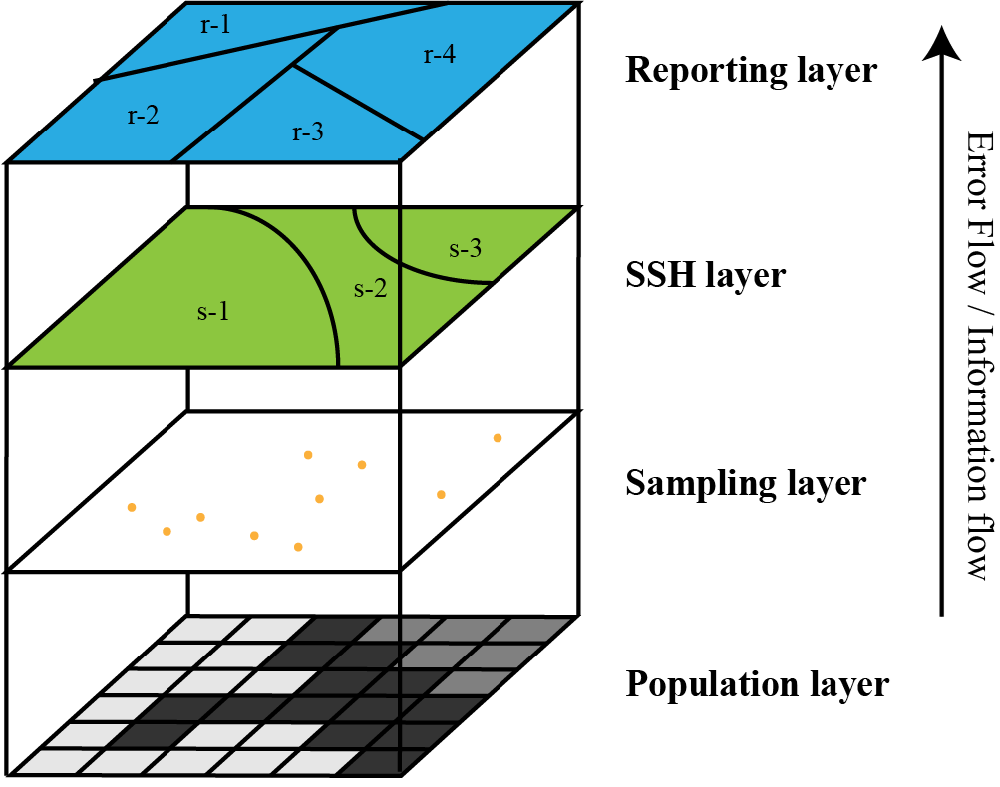

```{r setup, include = FALSE}
knitr::opts_chunk$set(echo = TRUE, warning=FALSE, message=FALSE, fig.cap = " ", fig.path='figs/')
```

The `sandwich` package implements the Sandwich model-based mapping^[Wang, J. F., Haining, R., Liu, T. J., Li, L. F., & Jiang, C. S. (2013). Sandwich estimation for multi-unit reporting on a stratified heterogeneous surface. *Environment and Planning A*, 45(10), 2515-2534.] based on the spatial stratified heterogeneity (SSH) theory^[Wang, J. F., Zhang, T. L., & Fu, B. J. (2016). A measure of spatial stratified heterogeneity. *Ecological Indicators*, 67, 250-256.]. It consists of sampling, SSH, and reporting layers. The goal of this model is to estimate the mean value of the sampling attribute and its standard error for each reporting unit leveraging the known distribution of the population in the SSH layer. Since the Sandwich model does not rely on the spatial dependence of the population, when the spatial dependence is weak, Sandwich is still applicable as long as one properly stratifies the geospatial surface. Figure 1 is an overview of the Sandwich model structure.

{width=50%}

To use the `sandwich` package, first install it using `install.packages()`, and then load the installed package into your environment using `library()`. Here,we present two case studies to demonstrate the functionality of this package.
```{r}
# Install sandwich package
# install.packages("sandwich")
# Import sandwich package
library("sandwich")
```


## Synthetic human population in Heshun County, China
The first case study interpolates the human population density in Heshun County, China based on a synthetic sample of 326 units. A zonation consists of 5 spatially contiguous strata is used as a candidate SSH layer. The administrative division of 10 towns in Heshun County is used as the reporting layer. The sampling, SSH, and reporting layers are all in the shapefile format.

### Loading data
To successfully run the model, the `load.data.shp` function is used to prepare the shapefiles of sampling, SSH, and reporting layers into a list of `sf` (simple feature; see [Simple Features for R](https://r-spatial.github.io/sf/index.html) for references) object for model input.
```{r}
# Input data from shapefiles
hs.data <- load.data.shp(path="./data", sampling.file="hs.sampling.shapefile", 
                         ssh.file="hs.ssh.shapefile", reporting.file="hs.reporting.shapefile")
```


### Selection of the SSH layer(s)
The accuracy of the Sandwich model is determined by the SSH layer. For an ideal SSH layer, values of the target attribute are expected to be homogeneous within each stratum and differ between the strata. To determine a proper SSH layer for the Sandwich model, the geographical detector model^[Wang, J. F., Li, X. H., Christakos, G., Liao, Y. L., Zhang, T., Gu, X., & Zheng, X. Y. (2010). Geographical detectors-based health risk assessment and its application in the neural tube defects study of the Heshun Region, China. *International Journal of Geographical Information Science*, 24(1), 107-127.] is applied to quantify the SSH of the target attribute with regard to the candidate stratification(s). 

For the purpose of demonstration, we input `hs.ssh2.shapefile` as another candidate SSH layer.
```{r}
# Input another candidate SSH layer for demonstration
hs.ssh2 <- read_sf(dsn="./data", layer="hs.ssh2.shapefile")
```

First, we combine the sampling and the candidate SSH layers to a single data frame.
```{r}
# Prepare the SSH layer(s) for evaluation
hs.join <- ssh.data.shp(object=hs.data[[1]], ssh.lyr=hs.data[[2]], ssh.id="STR_1")
hs.join <- ssh.data.shp(object=hs.join, ssh.lyr=hs.ssh2, ssh.id="STR_2")
head(hs.join)
```

The factor detector *q*-statistic in the geographical detector model is applied through the `ssh.test` function to measure the SSH of the sampling data in terms of different stratifications. This function takes a data frame generated from the `ssh.data.shp` (or `ssh.data.txt`, which will be introduced later) function (argument `object`), where the field names of the sampling attribute (argument `y`) and the strata ID(s) (argument `x`) need to be specified. In this example, the output of `ssh.test` implies that the original candidate SSH layer (*q* = .912) has a higher determinant power over the attribute (population density) compared to hs.ssh2 (*q* = .394). Therefore, compared to `hs.ssh2`, it will be more reasonable to select the original one as the SSH layer for subsequent interpolation.
```{r}
# Calculate the geographical detector q-statistic
ssh.test(object=hs.join, y="Population", x=c("STR_1", "STR_2"), test="factor")
```

The `ssh.test` function implements the interaction detector in the geographical detector model by specifying `test="interaction"`. The result of our example shows that the combined *q*-statistic of the original candidate SSH layer and `hs.ssh2` (*q* = .920) is approximately the same as that of using the original one alone (*q* = .912). Therefore, we can either optimize the SSH layer by combining two SSH layers or simply use the original one. For the purpose of simplicity, we will use the original one alone as the SSH layer in the subsequent modeling.
```{r}
# Calculate the interaction detector
ssh.test(object=hs.join, y="Population", x=c("STR_1", "STR_2"), test="interaction")
```


### Running the Sandwich model
The Sandwich model-based mapping is performed using the `sandwich.model` function, which outputs the mean value of the sampling attribute and its standard error for each reporting unit.
```{r}
# Perform the SSH based spatial interpolation
hs.sw <- sandwich.model(object=hs.data, sampling.attr="Population", type="shp")
head(hs.sw)
```

The Sandwich estimates and the standard error can be visualized using `plot.mean` and `plot.se()`.
```{r fig.align="center", fig.width=4, fig.height=3}
# Plot the mean values of the interpolation estimates
plot.mean(object=hs.sw)
# Plot the standard errors of the interpolation estimates
plot.se(object=hs.sw)
```

The confidence interval for the population mean in each reporting unit is computed using the `sandwich.ci` function. Here, we show an example of constructing a 95% confidence interval.
```{r}
# Calculate the confidence intervals of the interpolation estimates
hs.sw.ci <- sandwich.ci(object=hs.sw, level=.95)
head(hs.sw.ci)
```

The lower and upper bounds of the confidence interval can be visualized using the `plot.ci` function.
```{r fig.align="center", fig.width=8, fig.height=3}
# Plot the confidence intervals of the interpolation estimates
plot.ci(object=hs.sw.ci)
```

### Model validation
To evaluate the overall accuracy of the Sandwich model, a *k*-fold cross validation can be performed using the `sandwich.cv` function. A diagnostic statistic called root mean square error (RMSE) will be calculated. Here, we present the result of a 5-fold cross validation.
```{r}
# Perform k-fold cross validation
hs.cv <- sandwich.cv(object=hs.data, sampling.attr="Population", k=5, type="shp")
hs.cv
```


## Breast cancer incidence in mainland China
The second case study interpolates the breast cancer incidence across mainland China based on 242 samples retrieved from the Chinese Cancer Registry Annual Report. The urban-rural classification (either urban or rural areas are typically not connected in space) is used as the SSH layer. County-level divisions are used as the reporting units. In this example, all the input data are in csv format.

### Loading data
The `load.data.txt` function is used to prepare text files into a list of data frames for model input. Two files are needed for this function: one linking sampling and SSH layers. Each row denotes a sampling unit, and the other linking reporting and SSH layers. The general formats of these files are speficied below.

Sampling-SSH

| Sampling Attribute $y_{hi}$ | SSH Stratum $h$ | Reporting Unit $r$ | ... |
|-----------------------------|-----------------|-------------------:|-----|
| 0.97                        | 1               | 3                  | ... |

Reporting-SSH

| Reporting Unit $r$ | Weight $W_{rh_1}$ | Weight $W_{rh_2}$ | ... |
|--------------------|-------------------|------------------:|-----|
| 1                  | 0.4               | 0.5               | ... |

```{r}
# Input data from text files
bc.data <- load.data.txt(sampling_ssh.file="./data/bc_sampling_ssh.csv", 
                         reporting_ssh.file="./data/bc_reporting_ssh.csv")

# Sampling-SSH
head(bc.data[[1]])

# Reporting-SSH
head(bc.data[[2]])
```

### Selection of the SSH layer(s)
First, we use the `ssh.data.txt` function to convert the input data for evaluation.
```{r}
# Prepare the SSH layer for evaluation
bc.join <- ssh.data.txt(object=bc.data)
head(bc.join)
```


